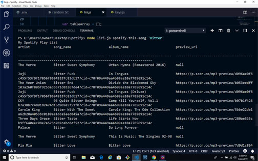

# liri node app
Week 10 (LIRI Bot) LIRI is a Language Interpretation and Recognition Interface.

LIRI is like iPhone's SIRI. However, while SIRI is a Speech Interpretation and Recognition Interface, LIRI is a Language Interpretation and Recognition Interface. LIRI will be a command line node app that takes in parameters and gives you back data.

### node liri.js spotify-this-song '<song name here>'

This will show the following information about the song in your terminal/bash window

   * Artist(s)
   * The song's name
   * A preview link of the song from Spotify
   * The album that the song is from

if no song is provided then your program will default to
"The Sign" by Ace of Base
